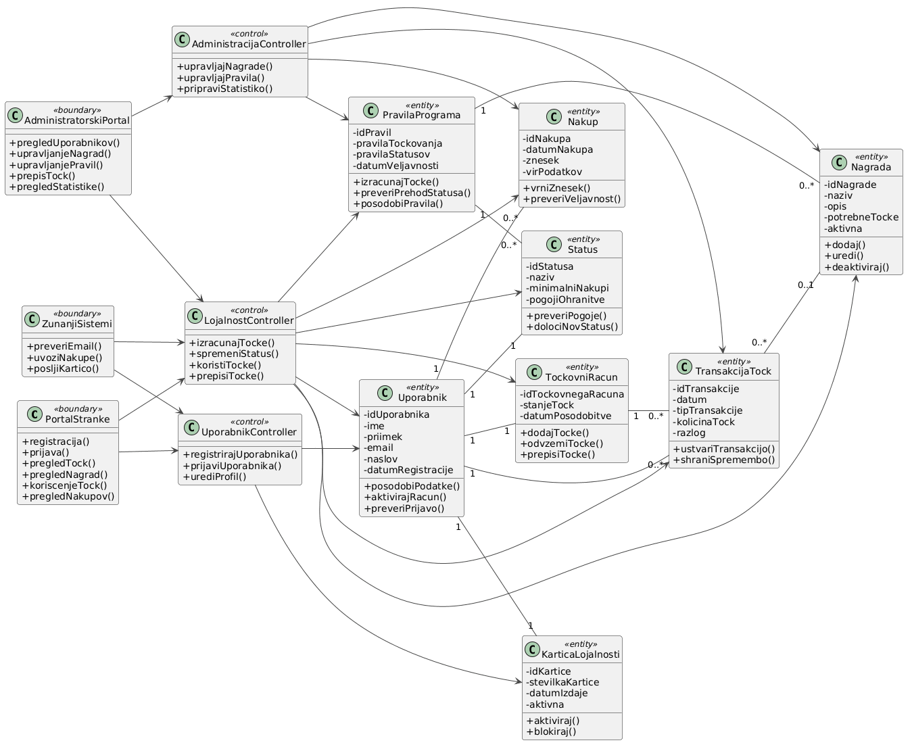
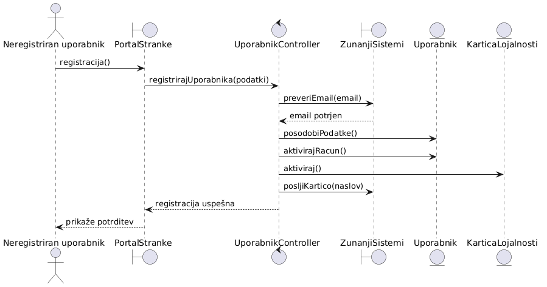
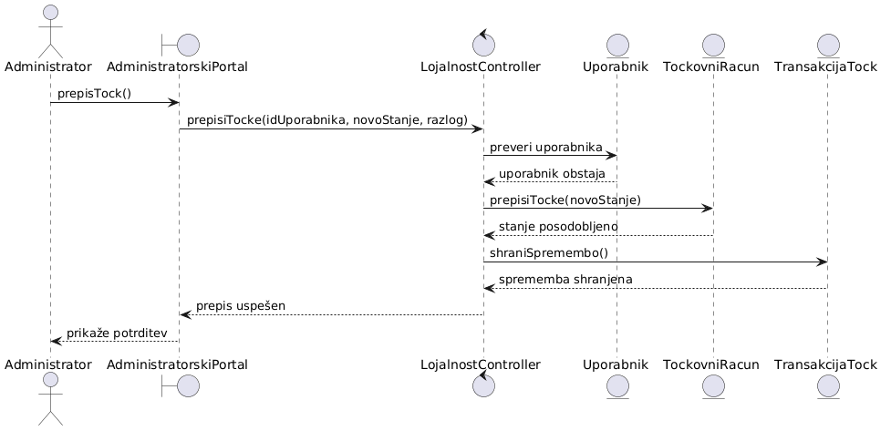

# Dokumentacija - Razredni diagram in diagrami zaporedja

## 1. Uvod

V tem delu dokumentacije sta predstavljena razredni diagram in diagrami zaporedja za informacijski sistem programa lojalnosti Maestro. Namen razrednega diagrama je prikaz glavnih razredov sistema, njihovih atributov, metod ter povezav med njimi. Diagram prikazuje tudi različne vrste razredov, kot so mejni (boundary), kontrolni (control) in entitetni (entity) razredi.

Poleg razrednega diagrama sta predstavljena tudi diagram zaporedja za dva primera uporabe:
- registracija uporabnika,
- prepis točk.

Diagrama zaporedja prikazujeta komunikacijo med uporabniki, vmesniki, kontrolnimi razredi in entitetami ter zaporedje izvajanja operacij znotraj sistema.

---

## 2. Razredni diagram

Razredni diagram prikazuje strukturo sistema programa lojalnosti Maestro. Diagram vsebuje glavne razrede sistema, njihove atribute in metode ter povezave med posameznimi razredi. Mejni razredi predstavljajo uporabniške in zunanje sisteme, kontrolni razredi izvajajo poslovno logiko sistema, entitetni razredi pa predstavljajo podatke in objekte znotraj sistema. V diagramu so prikazane tudi povezave med razredi, ki določajo sodelovanje med posameznimi deli sistema.

Spodaj je prikazan razredni diagram za IS programa lojalnosti Maestro.

---

## 3. Diagram zaporedja – Registracija uporabnika

Diagram zaporedja za registracijo uporabnika prikazuje postopek registracije novega uporabnika v sistem programa lojalnosti Maestro.Proces se začne z vnosom registracijskih podatkov preko portala za stranke. Kontrolni razred nato preveri veljavnost podatkov in e-poštnega naslova preko zunanjih sistemov. Po uspešni validaciji sistem ustvari uporabniški račun, aktivira kartico lojalnosti ter pošlje kartico uporabniku. Diagram prikazuje komunikacijo med uporabnikom, portalom za stranke, kontrolnim razredom in entitetnimi razredi sistema.

Spodaj je prikazan diagram zaporedja za registracijo uporabnika za IS programa lojalnosti Maestro.

---

## 4. Diagram zaporedja – Prepis točk

Diagram zaporedja za prepis točk prikazuje postopek ročne spremembe točk uporabnika s strani administratorja. Administrator preko administrativnega portala izbere uporabnika in vnese novo stanje točk. Kontrolni razred preveri obstoj uporabnika ter izvede spremembo stanja točk na točkovnem računu. Po uspešni spremembi sistem zabeleži transakcijo spremembe točk in administratorju prikaže potrditev o uspešno izvedeni operaciji. Diagram prikazuje komunikacijo med administratorjem, administrativnim portalom, kontrolnim razredom in entitetnimi razredi sistema.

Spodaj je prikazan diagram zaporedja za prepis točk za IS programa lojalnosti Maestro.

