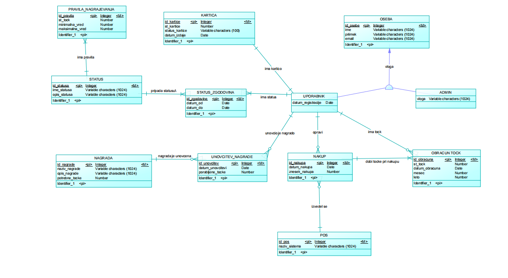

# Dokumentacija - Podatkovni model

## 1. Uvod

V tem dokumentu je predstavljen produktni model informacijskega sistema programa lojalnosti Maestro. Namen produktnega modela je prikaz strukture podatkov in odnosov med posameznimi entitetami v sistemu.  Za načrtovanje podatkovne strukture sem pripravila konceptualni model v PowerDesignerju, ki prikazuje glavne entitete sistema ter povezave med njimi.

## 2. Podatkovni model

Spodaj je prikazan konceptualni model za IS programa lojalnosti Maestro.

