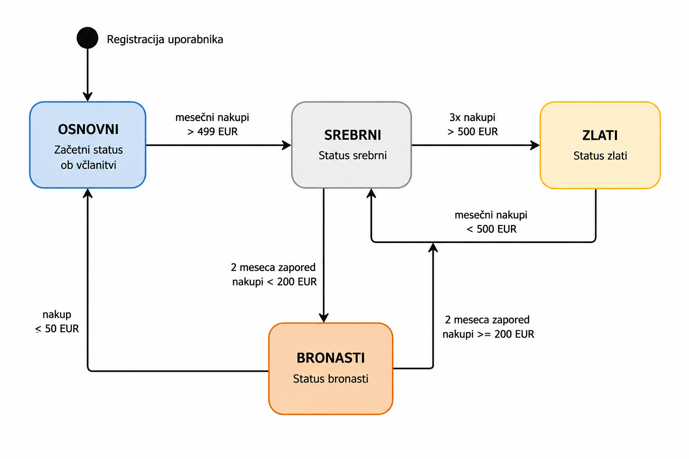

# Dokumentacija - Diagram prehajanja stanj med statusi

## 1.Uvod

Diagram prehajanja stanj prikazuje spremembe statusov uporabnikov v programu lojalnosti Maestro. Namen diagrama je prikazati, kako se status uporabnika spreminja glede na izpolnjevanje pogojev, povezanih z višino nakupov in aktivnostjo uporabnika v programu lojalnosti.

Sistem vsebuje več različnih statusov uporabnikov, med katerimi uporabniki prehajajo glede na pravila programa. Diagram omogoča boljši pregled nad življenjskim ciklom statusov ter prikazuje pogoje za napredovanje oziroma znižanje statusa.

## 2. Diagram prehajanja stanj med statusi

Spodaj je prikazan diagram prehajanja stanj med statusi za IS programa lojalnosti Maestro.

## 3. Predstavitev diagrama prehajanja stranj med statusi

Diagram prehajanja stanj prikazuje spremembe statusov uporabnikov v programu lojalnosti Maestro. Sistem vsebuje štiri glavne statuse:
- osnovni,
- srebrni,
- zlati,
- bronasti.

Ob registraciji uporabnik samodejno pridobi osnovni status. Nadaljnje spremembe statusov so odvisne od vrednosti mesečnih nakupov in izpolnjevanja pogojev programa lojalnosti.

Pravila prehajanja med statusi so naslednja:

- uporabnik ob registraciji prejme osnovni status,
- če uporabnik prvič preseže 499 EUR mesečnih nakupov, pridobi srebrni status,
- če uporabnik še dvakrat preseže 500 EUR mesečnih nakupov, pridobi zlati status,
- za ohranitev srebrnega statusa mora uporabnik mesečno opraviti najmanj 200 EUR nakupov,
- za ohranitev zlatega statusa mora uporabnik mesečno opraviti najmanj 500 EUR nakupov,
- če uporabnik ne izpolnjuje pogojev za ohranitev zlatega statusa, se njegov status spremeni v srebrni status,
- če uporabnik dva meseca zapored ne doseže 200 EUR nakupov, izgubi srebrni status in pridobi bronasti status,
- uporabnik v bronastem statusu ostane, dokler dva zaporedna meseca ne opravi najmanj 200 EUR nakupov,
- če uporabnik v bronastem statusu opravi nakup manjši od 50 EUR, se njegov status spremeni nazaj v osnovni status.

Diagram omogoča jasen pregled nad vsemi možnimi prehodi med statusi ter pogoji, ki vplivajo na spremembo statusa uporabnika.