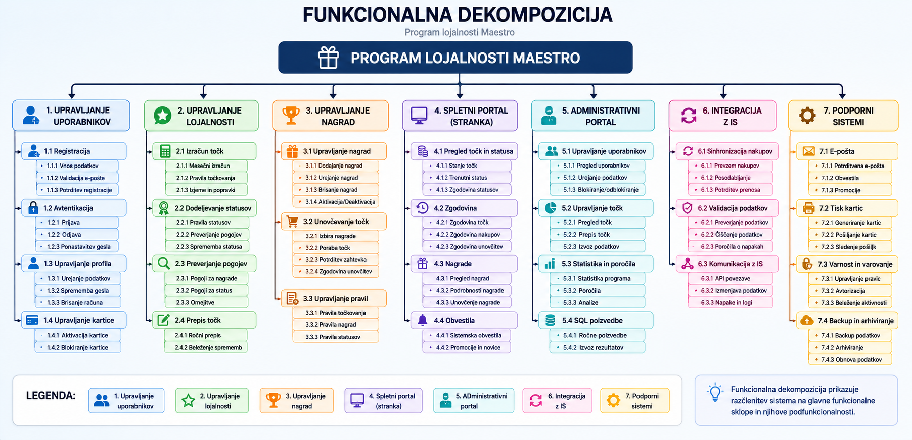

# Dokumentacija - Funkcionalno razgradje

## 1. Uvod

Funkcionalno razgradje ali dekompozicija predstavlja razčlenitev sistema na manjše funkcionalne sklope in podfunkcionalnosti. Namen funkcionalne dekompozicije je boljši pregled nad delovanjem sistema ter lažje razumevanje posameznih procesov in funkcij.

Za projekt programa lojalnosti Maestro sem pripravila funkcionalno dekompozicijo, ki prikazuje glavne dele sistema, kot so upravljanje uporabnikov, upravljanje lojalnosti, upravljanje nagrad, spletni portal, administrativni portal, integracija z zunanjimi sistemi ter podporni sistemi. Posamezni sklopi so dodatno razdeljeni na podfunkcionalnosti, ki omogočajo podrobnejši prikaz delovanja sistema.Diagram funkcionalne dekompozicije prikazuje hierarhično strukturo sistema in povezave med posameznimi funkcionalnimi področji.

## 2. Fukcionalno razgradje

Spodaj je prikazano funkcionalno razgradje za IS programa lojalnosti Maestro.

