# Dokumentacija - Zaslonske maske

## Uvod

Spletna aplikacija **Program lojalnosti Maestro** je namenjena uporabnikom trgovske verige Maestro in administratorjem sistema. Uporabnikom omogoča registracijo, prijavo, pregled zbranih točk, pregled transakcij, spremljanje mesečnih obračunov, koriščenje nagrad in urejanje osebnega profila. Administratorjem omogoča upravljanje uporabnikov, nagrad, transakcij, statistike in mesečnega obračuna točk.

---

## 1. Zaslonska maska: Prijava in registracija

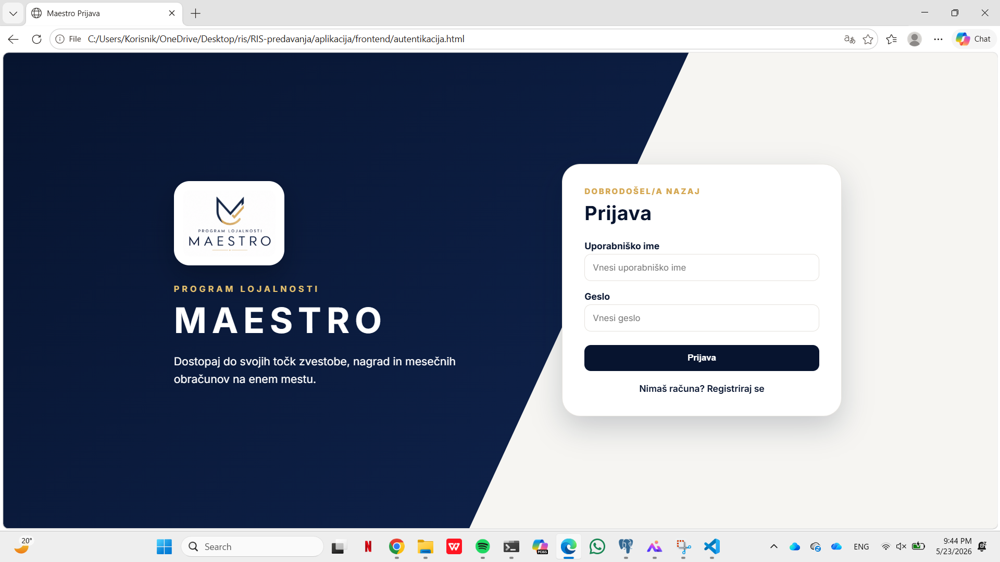

### Namen zaslonske maske

Zaslonska maska za prijavo in registracijo omogoča uporabniku dostop do sistema. Uporabnik se lahko prijavi z uporabniškim imenom in geslom ali pa ustvari nov uporabniški račun.

### Elementi zaslonske maske

Na levi strani zaslona je prikazan logotip Maestro in kratek opis programa lojalnosti. Na desni strani je obrazec za prijavo oziroma registracijo.

Obrazec za prijavo vsebuje:
- polje za uporabniško ime,
- polje za geslo,
- gumb **Prijava**,
- povezavo za prehod na registracijo.

Obrazec za registracijo vsebuje:
- polje za ime,
- polje za priimek,
- polje za e-pošto,
- polje za uporabniško ime,
- polje za geslo,
- gumb **Registracija**,
- povezavo za vrnitev na prijavo.

### Delovanje zaslonske maske

Če uporabnik vnese pravilne prijavne podatke, ga sistem preusmeri na ustrezno stran. Navaden uporabnik je preusmerjen na nadzorno ploščo, administrator pa na administratorski panel.

Če uporabnik vnese napačne podatke, sistem prikaže opozorilo. Pri registraciji sistem preveri, ali so vsa polja izpolnjena in ali uporabnik z enakim e-poštnim naslovom ali uporabniškim imenom že obstaja.

---

## 2. Zaslonska maska: Nadzorna plošča

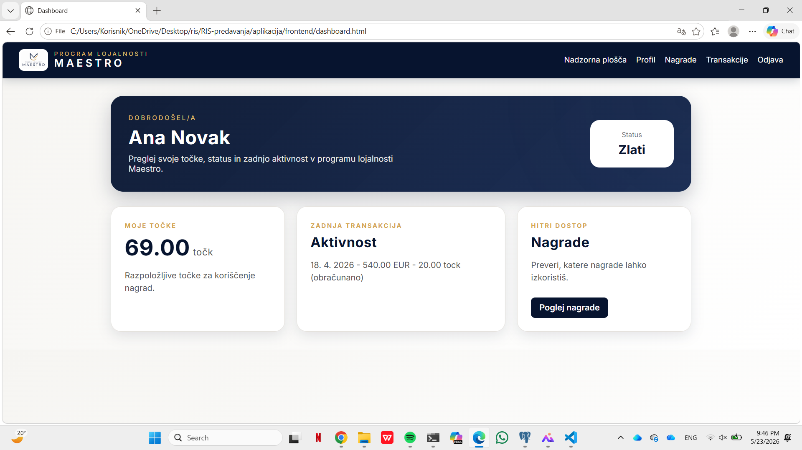

### Namen zaslonske maske

Nadzorna plošča je začetna stran navadnega uporabnika po prijavi. Uporabniku omogoča hiter pregled najpomembnejših informacij o njegovem članstvu v programu lojalnosti.

### Elementi zaslonske maske

Zaslonska maska vsebuje:
- navigacijsko vrstico z logotipom,
- povezave do strani: Nadzorna plošča, Profil, Nagrade, Transakcije in Odjava,
- pozdravni del z imenom uporabnika,
- prikaz trenutnega statusa uporabnika,
- kartico s številom zbranih točk,
- kartico z zadnjo transakcijo,
- povezavo do nagrad.

### Delovanje zaslonske maske

Ob odprtju strani se iz baze pridobijo sveži podatki o uporabniku. Prikažejo se ime, priimek, trenutni status in trenutno število točk. Točke se izračunajo na podlagi mesečnih obračunov in že izkoriščenih nagrad.

Zadnja transakcija prikazuje datum, znesek in status obračuna. Če transakcija še ni bila vključena v mesečni obračun, je označena kot čakajoča na obračun.

---

## 3. Zaslonska maska: Profil

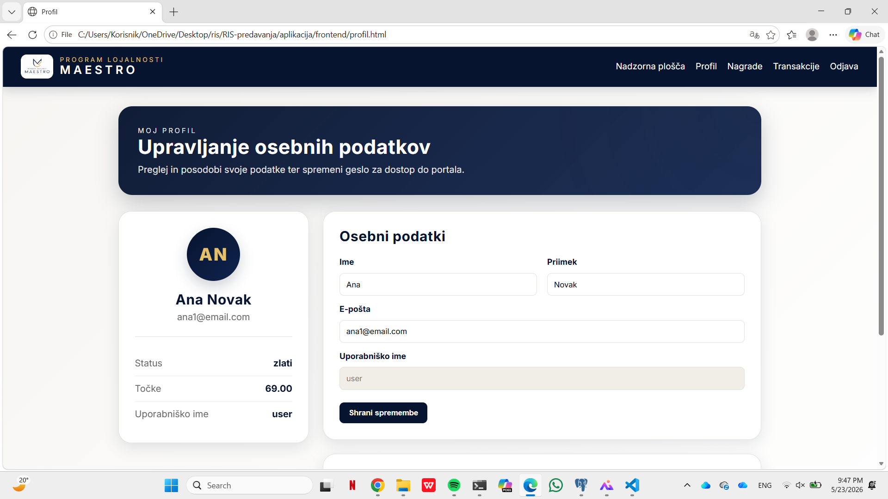
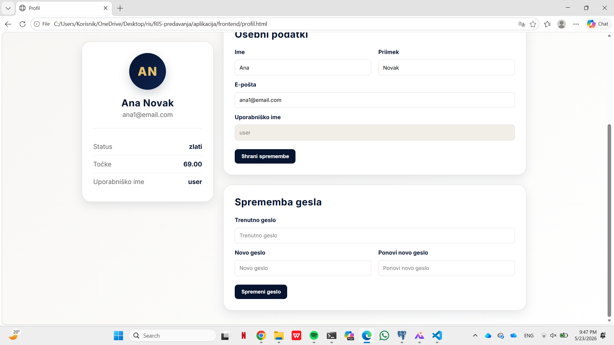

### Namen zaslonske maske

Zaslonska maska profila omogoča uporabniku pregled in urejanje osebnih podatkov ter spremembo gesla.

### Elementi zaslonske maske

Maska je razdeljena na dva glavna dela.

Levi del prikazuje povzetek profila:
- začetnici uporabnika,
- ime in priimek,
- e-poštni naslov,
- trenutni status,
- trenutno število točk,
- uporabniško ime.

Desni del vsebuje obrazce:
- obrazec za urejanje osebnih podatkov,
- obrazec za spremembo gesla.

Obrazec za urejanje osebnih podatkov vsebuje:
- ime,
- priimek,
- e-pošto,
- uporabniško ime, ki ga ni mogoče urejati,
- gumb **Shrani spremembe**.

Obrazec za spremembo gesla vsebuje:
- trenutno geslo,
- novo geslo,
- ponovitev novega gesla,
- gumb **Spremeni geslo**.

### Delovanje zaslonske maske

Ob odprtju strani se iz baze pridobijo podatki prijavljenega uporabnika. Uporabnik lahko spremeni ime, priimek in e-pošto. Po uspešni spremembi se podatki posodobijo tudi na prikazu profila.

Pri spremembi gesla mora uporabnik vnesti trenutno geslo in dvakrat novo geslo. Sistem preveri pravilnost trenutnega gesla in ujemanje novega gesla s potrditvijo. Če so podatki pravilni, se geslo posodobi.

---

## 4. Zaslonska maska: Nagrade

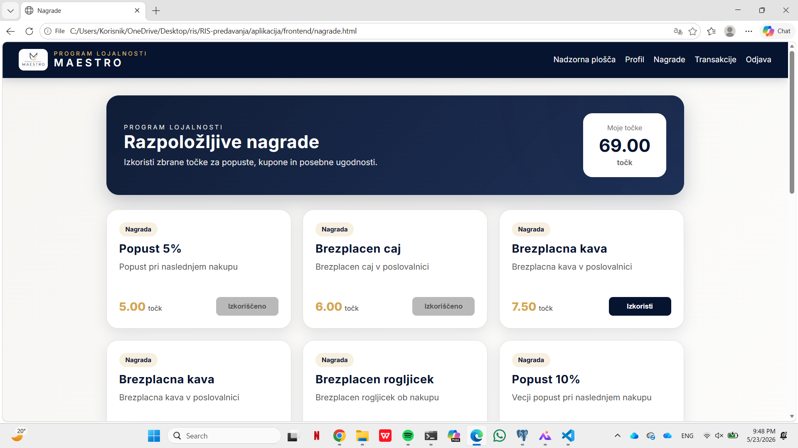

### Namen zaslonske maske

Zaslonska maska nagrad omogoča uporabniku pregled vseh aktivnih nagrad in koriščenje nagrad z zbranimi točkami.

### Elementi zaslonske maske

Maska vsebuje:
- navigacijsko vrstico,
- naslovni del z opisom strani,
- prikaz trenutnega števila uporabnikovih točk,
- seznam nagrad v obliki kartic.

Vsaka kartica nagrade vsebuje:
- naziv nagrade,
- opis nagrade,
- število potrebnih točk,
- gumb za koriščenje nagrade.

### Delovanje zaslonske maske

Ob odprtju strani se iz baze pridobijo vse aktivne nagrade. Sistem preveri tudi, katere nagrade je uporabnik že izkoristil.

Če uporabnik nagrade še ni izkoristil, je prikazan gumb **Izkoristi**. Če je nagrada že izkoriščena, je prikazan onemogočen gumb **Izkoriščeno**.

Ko uporabnik klikne na gumb za koriščenje nagrade, sistem preveri:
- ali uporabnik ima dovolj točk,
- ali nagrada obstaja,
- ali je nagrada aktivna,
- ali uporabnik te nagrade še ni izkoristil.

Če so pogoji izpolnjeni, se nagrada zabeleži kot izkoriščena, uporabniku pa se odšteje ustrezno število točk.

---

## 5. Zaslonska maska: Transakcije

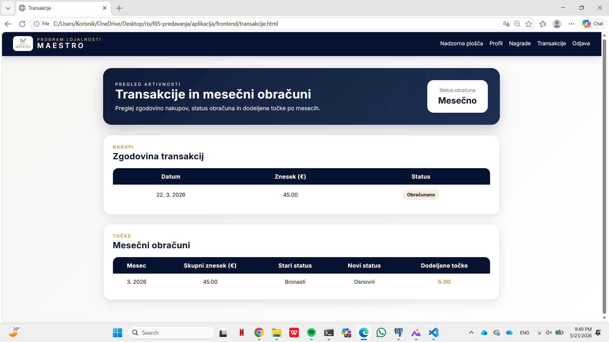

### Namen zaslonske maske

Zaslonska maska transakcij omogoča uporabniku pregled opravljenih nakupov in mesečnih obračunov točk.

### Elementi zaslonske maske

Maska vsebuje dva glavna sklopa:
- zgodovina transakcij,
- mesečni obračuni.

Tabela zgodovine transakcij vsebuje:
- datum transakcije,
- znesek transakcije,
- status transakcije.

Status transakcije je lahko:
- **Čaka obračun**,
- **Obračunano**.

Tabela mesečnih obračunov vsebuje:
- mesec in leto obračuna,
- skupni znesek nakupov,
- stari status,
- novi status,
- dodeljene točke.

### Delovanje zaslonske maske

Posamezne transakcije same po sebi ne povečajo točk uporabnika. Transakcije se najprej shranijo s statusom, da čakajo na mesečni obračun.

Pri mesečnem obračunu sistem sešteje zneske vseh neobračunanih transakcij za izbrani mesec. Nato najprej preveri in po potrebi spremeni status uporabnika, šele potem pa dodeli točke glede na novi status in skupni mesečni znesek nakupov.

Po uspešnem obračunu se transakcije označijo kot obračunane, v tabeli mesečnih obračunov pa se prikažejo rezultati obračuna.

---

## 6. Zaslonska maska: Administrator panel

### Namen zaslonske maske

Admin panel je namenjen administratorju sistema. Omogoča upravljanje uporabnikov, nagrad, transakcij, statistike in mesečnega obračuna točk.

### Elementi zaslonske maske

Admin panel vsebuje:
- navigacijsko vrstico z logotipom in odjavo,
- naslovni del z oznako administracije,
- zavihke za posamezne dele sistema.

Zavihki v admin panelu so:
- Uporabniki,
- Nagrade,
- Transakcije,
- Statistika,
- Poročila.

---

## 6.1 Zavihek: Uporabniki

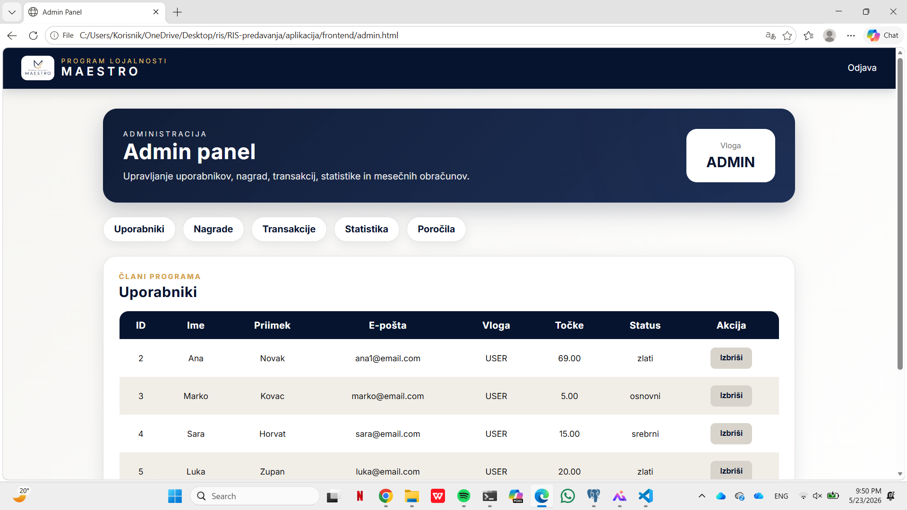

### Namen

Zavihek uporabnikov administratorju omogoča pregled navadnih uporabnikov sistema.

### Elementi

Tabela uporabnikov vsebuje:
- ID uporabnika,
- ime,
- priimek,
- e-pošto,
- vlogo,
- trenutno število točk,
- status,
- akcijo za brisanje.

### Delovanje

V tabeli se prikazujejo samo navadni uporabniki, administrator pa ni prikazan med uporabniki. Administrator lahko izbriše uporabnika, če to želi. Pri brisanju se uporabnik odstrani iz baze.

---

## 6.2 Zavihek: Nagrade

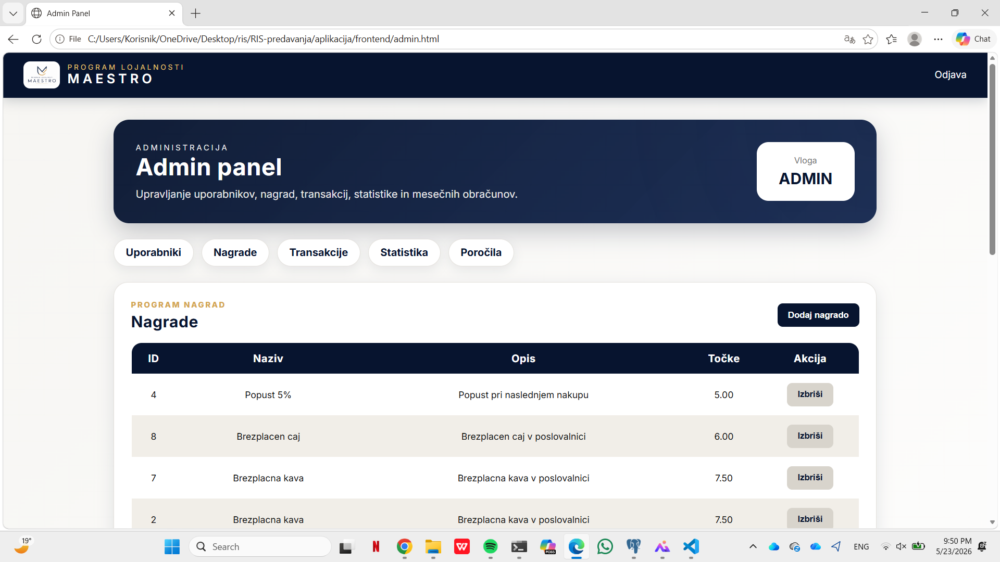

### Namen

Zavihek nagrad omogoča administratorju upravljanje nagrad, ki jih uporabniki lahko izkoristijo s točkami.

### Elementi

Tabela nagrad vsebuje:
- ID nagrade,
- naziv,
- opis,
- število potrebnih točk,
- akcijo za brisanje.

Obrazec za dodajanje nagrade vsebuje:
- naziv nagrade,
- opis nagrade,
- potrebno število točk,
- gumb **Shrani**.

### Delovanje

Administrator lahko doda novo nagrado. Po dodajanju se nagrada prikaže med aktivnimi nagradami in je uporabnikom na voljo za koriščenje.

Administrator lahko nagrado tudi izbriše. Brisanje je izvedeno kot deaktivacija, zato nagrada ni več prikazana uporabnikom, podatki pa ostanejo v sistemu.

---

## 6.3 Zavihek: Transakcije

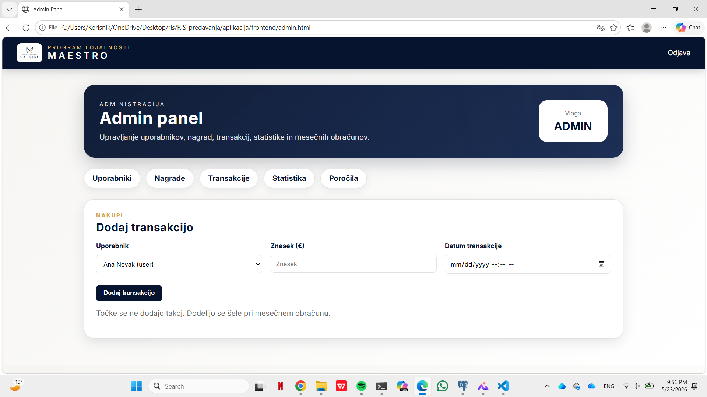

### Namen

Zavihek transakcij omogoča administratorju dodajanje novih transakcij za uporabnike.

### Elementi

Obrazec za dodajanje transakcije vsebuje:
- izbor uporabnika,
- znesek transakcije,
- datum transakcije,
- gumb **Dodaj transakcijo**.

### Delovanje

Administrator izbere uporabnika, vnese znesek in datum transakcije. Transakcija se shrani v bazo, vendar se točke uporabniku ne dodajo takoj.

Dodana transakcija čaka na mesečni obračun. Šele pri mesečnem obračunu sistem določi, koliko točk uporabnik prejme za skupni mesečni znesek nakupov.

---

## 6.4 Zavihek: Statistika

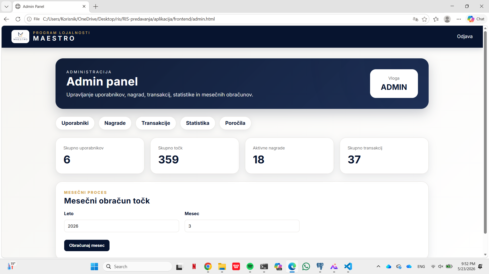

### Namen

Zavihek statistike administratorju omogoča pregled osnovnih podatkov o sistemu in izvedbo mesečnega obračuna.

### Elementi

Prikazane so kartice z naslednjimi podatki:
- skupno število uporabnikov,
- skupno število točk,
- število aktivnih nagrad,
- skupno število transakcij.

Obrazec za mesečni obračun vsebuje:
- leto,
- mesec,
- gumb **Obračunaj mesec**.

### Delovanje

Administrator vnese leto in mesec ter sproži mesečni obračun. Sistem poišče vse neobračunane transakcije za izbrani mesec, jih združi po uporabnikih in za vsakega uporabnika izračuna skupni mesečni znesek nakupov.

Pri obračunu sistem:
1. preveri trenutni status uporabnika,
2. glede na znesek nakupov določi novi status,
3. glede na novi status in znesek nakupov določi število točk,
4. shrani mesečni obračun,
5. označi transakcije kot obračunane,
6. posodobi skupno število točk uporabnika.

Isti mesec se za istega uporabnika ne sme obračunati večkrat.

---

## 6.5 Zavihek: Poročila

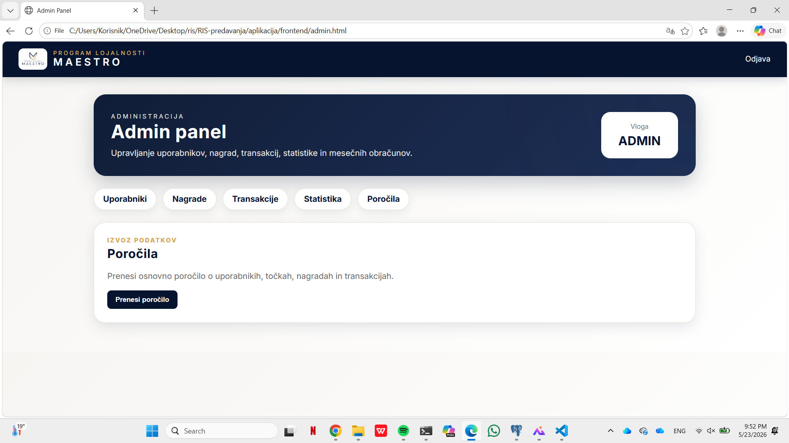

### Namen

Zavihek poročil omogoča administratorju izvoz osnovnega poročila o sistemu.

### Elementi

Maska vsebuje:
- kratek opis poročila,
- gumb **Prenesi poročilo**.

### Delovanje

Ob kliku na gumb sistem pripravi besedilno poročilo, ki vsebuje osnovne statistične podatke, kot so število uporabnikov, skupno število točk, aktivne nagrade in število transakcij.

---

## 7. Zaščita zaslonskih mask

Aplikacija uporablja zaščito strani glede na prijavo uporabnika.

Če uporabnik ni prijavljen, ne more dostopati do naslednjih strani:
- nadzorna plošča,
- profil,
- nagrade,
- transakcije.

Če uporabnik nima administratorske vloge, ne more dostopati do admin panela. V tem primeru ga sistem preusmeri nazaj na uporabniški del aplikacije.

Odjava izbriše podatke o prijavljenem uporabniku iz lokalnega pomnilnika brskalnika in uporabnika preusmeri na prijavno stran.

---

## 8. Sklep za zaslonske maske

Zaslonske maske aplikacije Program lojalnosti Maestro omogočajo uporabnikom enostavno uporabo programa lojalnosti, administratorjem pa pregledno upravljanje sistema. Uporabniški del je namenjen pregledu točk, transakcij, nagrad in profila, administratorski del pa omogoča upravljanje ključnih podatkov in izvajanje mesečnih obračunov.

Aplikacija s tem pokriva glavne zahteve programa lojalnosti: registracijo uporabnikov, pregled in koriščenje točk, pregled transakcij, mesečni obračun točk, prehajanje med statusi ter upravljanje nagrad in uporabnikov.

---

## 9. Matrika sledljivosti

Matrika sledljivosti prikazuje povezavo med primeri uporabe iz diagrama primerov uporabe in deli aplikacije **Program lojalnosti Maestro**. Namen matrike je prikazati, kje se posamezen primer uporabe odraža v aplikaciji, kateri akter ga uporablja in kateri deli sistema sodelujejo pri njegovi izvedbi.

| ID primera uporabe | Primer uporabe | Akter | Opis povezave z aplikacijo | Zaslonska maska / modul |
|---|---|---|---|---|
| PU1 | Registracija uporabnika | Neregistriran uporabnik | Uporabnik vnese osebne podatke, e-pošto, uporabniško ime in geslo. Sistem ustvari uporabniški račun in uporabniku dodeli začetni status. | `autentikacija.html`, `auth.js`, `authController`, `users` |
| PU2 | Validacija e-pošte | E-poštni sistem | Pri registraciji se preveri e-poštni naslov uporabnika in prepreči uporaba že obstoječega e-poštnega naslova. | `authController`, `users` |
| PU3 | Ustvarjanje računa | Sistem | Po uspešni registraciji se v podatkovni bazi ustvari nov uporabniški račun. | `authController`, `users` |
| PU4 | Začetni status | Sistem | Ob ustvarjanju računa sistem uporabniku nastavi začetni status `osnovni`. | `authController`, `users` |
| PU5 | Prijava uporabnika | Neprijavljen uporabnik | Uporabnik se prijavi z uporabniškim imenom in geslom. Sistem preveri podatke in uporabnika preusmeri na ustrezen del aplikacije. | `autentikacija.html`, `auth.js`, `authController` |
| PU6 | Pregled nagrad | Prijavljen uporabnik / član programa | Uporabnik pregleda seznam aktivnih nagrad, opis nagrade in število potrebnih točk. | `nagrade.html`, `nagrade.js`, `rewardController`, `rewards` |
| PU7 | Pregled točk | Prijavljen uporabnik / član programa | Uporabnik vidi trenutno število zbranih točk na nadzorni plošči in v profilu. | `dashboard.html`, `profil.html`, `pointsHelper`, `monthly_calculations`, `reward_claims` |
| PU8 | Koriščenje točk | Prijavljen uporabnik / član programa | Uporabnik izkoristi nagrado, če ima dovolj točk in nagrade še ni izkoristil. | `nagrade.html`, `nagrade.js`, `rewardController`, `reward_claims` |
| PU9 | Pregled nakupov | Prijavljen uporabnik / član programa | Uporabnik vidi seznam svojih transakcij, zneske nakupov in status obračuna transakcije. | `transakcije.html`, `transakcije.js`, `transactionController`, `transactions` |
| PU10 | Statistika nakupov | Administrator | Administrator vidi osnovno statistiko sistema, kot so število uporabnikov, skupne točke, aktivne nagrade in število transakcij. | `admin.html`, `admin.js`, `adminController` |
| PU11 | Poizvedbe | Administrator | Administrator ima prek administratorskega dela dostop do pregledov podatkov in statistike, ki predstavljajo pripravljene poizvedbe nad podatki. | `admin.html`, `adminController` |
| PU12 | Upravljanje nagrad | Administrator | Administrator lahko dodaja nove nagrade in deaktivira obstoječe nagrade. | `admin.html`, `admin.js`, `adminController`, `rewards` |
| PU13 | Pošiljanje kartice | Administrator / Poštna služba | Registracija uporabnika predstavlja osnovo za izdajo kartice lojalnosti in posredovanje podatkov za pošiljanje kartice. | `users`, registracija uporabnika |
| PU14 | Prilagodi točkovnik | Administrator | Pravila za dodeljevanje točk so shranjena v podatkovni bazi in se uporabljajo pri mesečnem obračunu. | `loyalty_points_rules`, `adminController` |
| PU15 | Urejanje pravil statusov | Administrator | Pravila za prehajanje med statusi so shranjena v podatkovni bazi in jih uporablja logika mesečnega obračuna. | `loyalty_status_rules`, `adminController` |
| PU16 | Mesečni izračun točk | Administrator | Administrator sproži mesečni obračun za izbrano leto in mesec. Sistem sešteje mesečne nakupe, spremeni status in dodeli točke. | `admin.html`, `admin.js`, `adminController`, `monthly_calculations` |
| PU17 | Koriščenje točk | Administrator | Administrator lahko spremlja koriščenje točk prek podatkov o uporabnikih, nagradah in izkoriščenih nagradah. | `admin.html`, `reward_claims`, `pointsHelper` |
| PU18 | Prepis točk | Administrator | Točke uporabnika so vezane na mesečne obračune in koriščenje nagrad. Sistem pri prikazu ponovno izračuna pravilno stanje točk. | `pointsHelper`, `monthly_calculations`, `reward_claims` |
| PU19 | Pregled statusov | Administrator | Administrator vidi trenutne statuse uporabnikov, uporabnik pa v mesečnih obračunih vidi prehode iz starega v novi status. | `admin.html`, `transakcije.html`, `monthly_calculations` |
| PU20 | Spreminjanje pravil | Administrator | Sistem uporablja ločene tabele za pravila statusov in pravila točkovanja, zato se vrednosti pravil lahko prilagodijo v podatkovni bazi. | `loyalty_points_rules`, `loyalty_status_rules` |
| PU21 | Integracija z IS | Poslovni IS | Transakcije v aplikaciji predstavljajo podatke o nakupih, ki bi jih v dejanskem sistemu zagotavljal poslovni informacijski sistem. | `transactions`, admin dodajanje transakcij |
| PU22 | Sprememba statusa | Sistem | Pri mesečnem obračunu sistem preveri pravila statusov in po potrebi spremeni status uporabnika. | `adminController`, `calculateNewStatus`, `users` |
| PU23 | Upoštevanje statusa | Sistem | Sistem pri obračunu najprej določi novi status, nato pa na podlagi tega statusa določi število dodeljenih točk. | `adminController`, `loyalty_points_rules` |
| PU24 | Pregled točk / upravljanje točk | Administrator | Administrator vidi točke uporabnikov, sistem pa jih izračunava iz mesečnih obračunov in izkoriščenih nagrad. | `admin.html`, `pointsHelper`, `users` |
| PU25 | Upravljanje pravil | Administrator | Pravila za točkovanje in prehajanje med statusi so shranjena v ločenih tabelah in jih uporablja mesečni obračun. | `loyalty_points_rules`, `loyalty_status_rules`, `adminController` |

---

### Povezava primerov uporabe z zaslonskimi maskami

| Zaslonska maska | Povezani primeri uporabe |
|---|---|
| Prijava in registracija | PU1, PU2, PU3, PU4, PU5 |
| Nadzorna plošča | PU7 |
| Profil | PU7 |
| Nagrade | PU6, PU8 |
| Transakcije | PU9, PU16, PU19 |
| Admin panel – Uporabniki | PU10, PU19, PU24 |
| Admin panel – Nagrade | PU12, PU17 |
| Admin panel – Transakcije | PU16, PU21 |
| Admin panel – Statistika | PU10, PU16 |
| Admin panel – Poročila | PU10 |
| Baza pravil | PU14, PU15, PU20, PU25 |

---

### Sklep za matriko sledljivosti

Matrika sledljivosti prikazuje, da so primeri uporabe iz diagrama povezani z zaslonskimi maskami, backend moduli in podatkovno bazo aplikacije. Uporabniški del aplikacije pokriva registracijo, prijavo, pregled točk, pregled nakupov in koriščenje nagrad, administratorski del pa podpira upravljanje uporabnikov, nagrad, transakcij, mesečni obračun in pregled statistike.