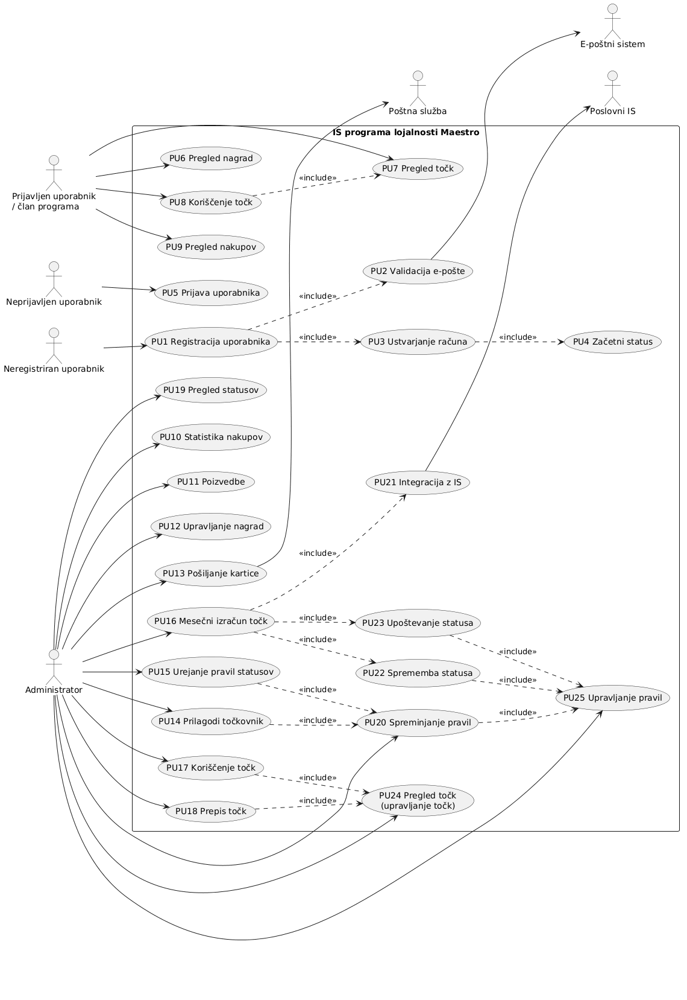

# Dokumentacija – Diagram primera uporabe

## 1. Uvod

V tem delu dokumentacije so predstavljene funkcionalne zahteve sistema programa lojalnosti Maestro. Opisane so glavne funkcionalnosti, ki jih sistem omogoča uporabnikom in administratorjem. Poleg funkcionalnih zahtev so predstavljeni tudi vmesniki sistema ter diagram primera uporabe, ki prikazuje povezave med akterji in funkcionalnostmi sistema. Diagram omogoča boljši pregled nad delovanjem sistema in njegovimi glavnimi procesi.

## 2. Diagram primera uporabe

Spodaj je prikazan diagram primera uporabe za IS programa lojalnosti Maestro.

---

## 3. Opis primerov uporabe

## PU1 – Registracija uporabnika

### Namen
Uporabnik se registrira v sistem programa lojalnosti Maestro in pridobi uporabniški račun.

### Akterji
- Neregistriran uporabnik
- E-poštni sistem

### Predpogoji
- Uporabnik še nima ustvarjenega računa.
- Sistem je dostopen.

### Osnovni potek
1. Uporabnik izbere možnost registracije.
2. Sistem zahteva vnos osebnih podatkov in e-pošte.
3. Uporabnik vnese zahtevane podatke.
4. Sistem preveri veljavnost e-pošte.
5. Sistem ustvari uporabniški račun.
6. Sistem pošlje potrditveno e-pošto.
7. Uporabniku se dodeli začetni status.

### Alternativni potek
Če je e-pošta že uporabljena, sistem prikaže obvestilo o napaki in registracija se ne zaključi.

### Po pogoji
- Uporabniški račun je ustvarjen.
- Uporabnik lahko uporablja funkcionalnosti sistema.

---

## PU18 – Prepis točk

### Namen
Administrator uporabniku dodeli oziroma prepiše točke v sistemu.

### Akterji
- Administrator
- Poslovni IS

### Predpogoji
- Administrator je prijavljen v sistem.
- Uporabnik obstaja v sistemu.

### Osnovni potek
1. Administrator izbere možnost upravljanja točk.
2. Sistem prikaže podatke o uporabniku in trenutnem številu točk.
3. Administrator vnese novo vrednost oziroma spremembo točk.
4. Sistem preveri pravilnost vnosa.
5. Sistem posodobi stanje točk.
6. Sistem shrani spremembo v bazo podatkov.

### Alternativni potek
Če uporabnik ne obstaja, sistem prikaže napako in prepis točk ni izveden.

Če je vnos neveljaven, sistem zahteva ponovni vnos podatkov.

### Po pogoji
- Točke uporabnika so uspešno posodobljene.
- Sprememba je evidentirana v sistemu.

---

## 4. Vmesniki sistema

### V1 – Uporabniški spletni vmesnik
Spletni vmesnik, preko katerega se uporabniki registrirajo, prijavljajo, pregledujejo točke, nagrade in zgodovino nakupov.

### V2 – Administratorski vmesnik
Vmesnik za administratorje za upravljanje nagrad, pravil programa, statusov in točk uporabnikov.

### V3 – Vmesnik za e-pošto
Povezava z e-poštnim sistemom za pošiljanje potrditvenih in obvestilnih sporočil uporabnikom.

### V4 – Vmesnik za poslovni IS
Povezava s poslovnim informacijskim sistemom za prenos podatkov o nakupih in izračun točk.

### V5 – Vmesnik za poštno službo
Povezava s poštno službo za pošiljanje fizičnih kartic članom programa lojalnosti.