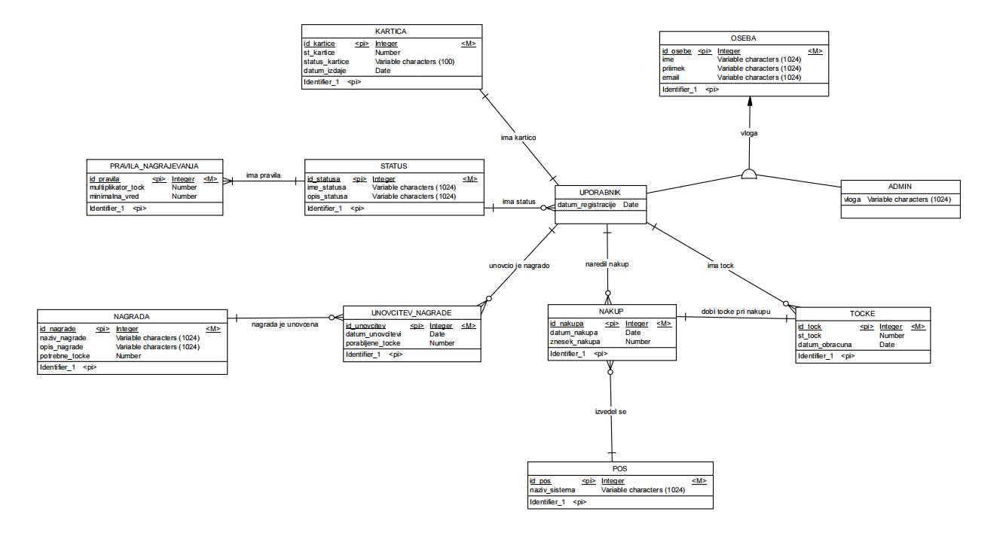

# Predavanje 25.3.2026 – Specifikacija Programa lojalnosti

## 7. Funkcionalna dekompozicija

    Program lojalnosti Maestro
    │
    ├── Upravljanje uporabnikov
    │   ├── Registracija
    │   ├── Avtentikacija
    │   ├── Urejanje podatkov
    │
    ├── Upravljanje lojalnosti
    │   ├── Izračun točk
    │   ├── Dodeljevanje statusov
    │   ├── Preverjanje pogojev
    │
    ├── Upravljanje nagrad
    │   ├── Dodajanje nagrad
    │   ├── Urejanje nagrad
    │   ├── Unovčevanje točk
    │
    ├── Spletni portal
    │   ├── Prikaz točk
    │   ├── Zgodovina nakupov
    │   ├── Obvestila
    │
    ├── Administrativni portal
    │   ├── Statistika
    │   ├── Poročila
    │   ├── SQL poizvedbe
    │
    ├── Integracija
    │   ├── Sinhronizacija nakupov
    │   ├── Validacija podatkov
    │
    └── Podporni sistemi
        ├── E-pošta
        ├── Tisk kartic

---

## 8. Konceprualni model 

